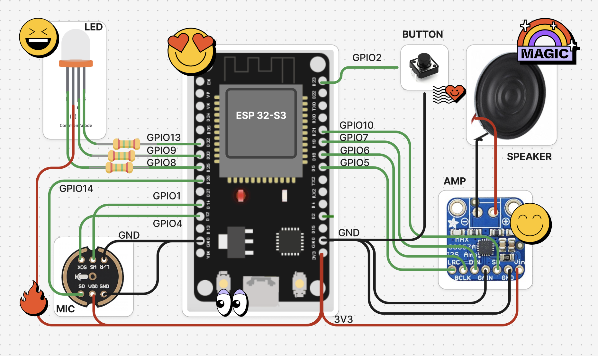
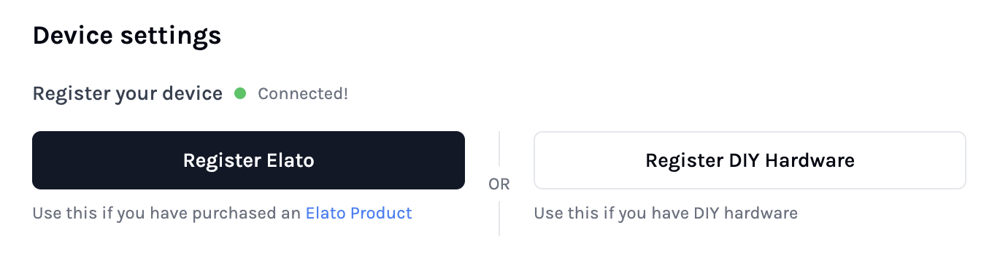
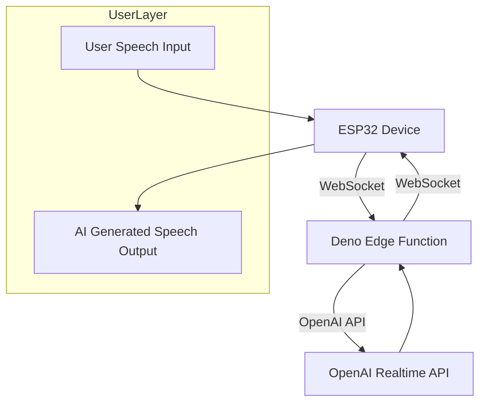
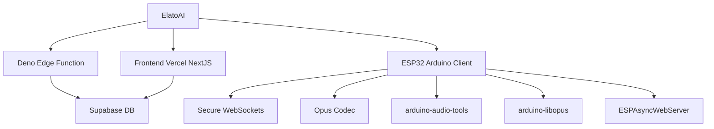

# 🚀 ElatoAI: Realtime Speech AI Agents for ESP32

Realtime AI Speech powered by OpenAI Realtime API, ESP32, Secure WebSockets, and Deno Edge Functions for >15-minute uninterrupted global conversations


<div align="center">

[](https://discord.gg/KJWxDPBRUj)
[](https://opensource.org/licenses/MIT)


</div>

## 📽️ Demo Video

<div align="center">
    <a href="https://www.youtube.com/watch?v=o1eIAwVll5I" target="_blank">
    
  </a>
<h3>

[Homepage](https://elatoai.com/) | [Buy AI device](https://www.elatoai.com/products) | [Buy AI Dev Kit](https://www.elatoai.com/products/ai-devkit)

</h3>

</div>

## ⚡️ DIY Hardware Design



## 📱 App Design

Control your ESP32 AI device from your phone with the Elato AI webapp.


| Select from a list of AI characters | Talk to your AI with real-time responses | Create personalized AI characters |
|:--:|:--:|:--:|


## 🚀 Quick Start

<a href="https://www.youtube.com/watch?v=bXrNRpGOJWw">
  
</a>

1. **Clone the repository**

```bash
git clone git@github.com:akdeb/ElatoAI.git
```

2. **Start Supabase**

Install [Supabase CLI](https://supabase.com/docs/guides/local-development/cli/getting-started) and set up your Local Supabase Backend. Make sure you have [Docker Desktop](https://www.docker.com/products/docker-desktop/) set up. Then from the root directory, run:
```bash
brew install supabase/tap/supabase
supabase start # This starts your local Supabase server with the default migrations and seed data.
```

3. **Set up your NextJS Frontend**

([See the Frontend README](frontend-nextjs/README.md)) 

From the `frontend-nextjs` directory, run the following commands. (**Login creds:** Email: `admin@elatoai.com`, Password: `admin`)
```bash
cd frontend-nextjs
npm install
cp .env.example .env.local

# In .env.local, set your environment variables 
# NEXT_PUBLIC_SUPABASE_ANON_KEY=<your-supabase-anon-key>
# OPENAI_API_KEY=<your-openai-api-key>

# Run the development server
npm run dev
```

4. **Choose edge server option**



- **ELATO MODE:** Got your own ESP32 DIY hardware device? We offer a fully hosted edge server for you to use! Register your device on the [settings page](https://www.elatoai.com/home/settings/device) and it will automatically connect to our edge server. Check out our [Pricing page](https://www.elatoai.com/#pricing) for more details.

- **DEV MODE:** Alternatively, you can run your own edge server locally by following the instructions below and in the [Deno server README](server-deno/README.md).

> **Pro Tip:** You can adjust this server setting in the `firmware-arduino/Config.h` file.

5. **If you choose to run your own edge server locally:**


```bash
# Navigate to the server directory
cd server-deno
cp .env.example .env

# In .env, set your environment variables 
# SUPABASE_KEY=<your-supabase-anon-key>
# OPENAI_API_KEY=<your-openai-api-key>

# Run the server at port 8000
deno run -A --env-file=.env main.ts
```

6. **Setup the ESP32 Device firmware**

([See the ESP32 Device README](firmware-arduino/README.md))

In `Config.cpp` set `ws_server` and `backend_server` to your local IP address. Run `ifconfig` in your console and find `en0` -> `inet` -> `192.168.1.100` (it may be different for your Wifi network). This tells the ESP32 device to connect to your NextJS frontend and Deno server running on your local machine. All services should be on the same Wifi network.

7. **Setup the ESP32 Device Wifi**

Build and upload the firmware to your ESP32 device. The ESP32 should open an `ELATO-DEVICE` captive portal to connect to Wifi. Connect to it and go to `http://192.168.4.1` to configure the device wifi.

8. **Turn on your device**

Once your Wifi credentials are configured, turn the device off and on again and it should connect to your Wifi and your server. Now you can talk to your AI Character!


## 🤖🤖🤖 Getting Started with multiple devices

1. Register your device by adding your ESP32 Device's MAC Address and a unique user code to the `devices` table in Supabase.
> **Pro Tip:** To find your ESP32-S3 Device's MAC Address, build and upload `test/print_mac_address_test.cpp` using PlatformIO and view the serial monitor.


2. Register your user account to this device by adding your unique user code to the [Settings page](http://localhost:3000/home/settings) in the NextJS Frontend. This links your device to your account.


3. Set DEV_MODE to `False` in your `frontend-nextjs/.env.local` env variable.

> **Pro Tip:** If you're testing locally, you can keep enabled the `DEV_MODE` macro in the `Config.h` file of your firmware and the Deno server env variable to use your local IP addresses for testing.


4. Now you can register multiple devices to your account by repeating the process above.

## Project Architecture

ElatoAI consists of three main components:

1. **Frontend Client** (`Next.js` hosted on Vercel) - to create and talk to your AI agents and 'send' it to your ESP32 device
2. **Edge Server Functions** (`Deno` running on Deno/Supabase Edge) - to handle the websocket connections from the ESP32 device and the OpenAI API calls
3. **ESP32 IoT Client** (`PlatformIO/Arduino`) - to receive the websocket connections from the Edge Server Functions and send audio to the OpenAI API via the Deno edge server.


## 🌟 Features

1. **Realtime Speech-to-Speech**: Instant speech conversion powered by OpenAI's Realtime APIs.
2. **Create Custom AI Agents**: Create custom agents with different personalities and voices.
3. **Customizable Voices**: Choose from a variety of voices and personalities.
4. **Secure WebSockets**: Reliable, encrypted WebSocket communication.
5. **Server VAD Turn Detection**: Intelligent conversation flow handling for smooth interactions.
6. **Opus Audio Compression**: High-quality audio streaming with minimal bandwidth.
7. **Global Edge Performance**: Low latency Deno Edge Functions ensuring seamless global conversations.
8. **ESP32 Arduino Framework**: Optimized and easy-to-use hardware integration.
9. **Conversation History**: View your conversation history.
10. **Device Management and Authentication**: Register and manage your devices.
11. **User Authentication**: Secure user authentication and authorization.
12. **Conversations with WebRTC and Websockets**: Talk to your AI with WebRTC on the NextJS webapp and with websockets on the ESP32.
13. **Volume Control**: Control the volume of the ESP32 speaker from the NextJS webapp.
14. **Realtime Transcripts**: The realtime transcripts of your conversations are stored in the Supabase DB.
15. **OTA Updates**: Over the Air Updates for the ESP32 firmware.
16. **Wifi Management with captive portal**: Connect to your Wifi network from the ESP32 device.
17. **Factory Reset**: Factory reset the ESP32 device from the NextJS webapp.
18. **Button and Touch Support**: Use the button OR touch sensor to control the ESP32 device.
19. **No PSRAM Required**: The ESP32 device does not require PSRAM to run the speech to speech AI.
20. **OAuth for Web client**: OAuth for your users to manage their AI characters and devices.
21. **Pitch Factor**: Control the pitch of the AI's voice from the NextJS webapp to create cartoon-like voices.

## 🛠 Tech Stack

| Component       | Technology Used                          |
|-----------------|------------------------------------------|
| Frontend        | Next.js, Vercel            |
| Backend         | Supabase DB  |
| Edge Functions  | Deno Edge Functions on Deno/Supabase          |
| IoT Client      | PlatformIO, Arduino Framework, ESP32-S3  |
| Audio Codec     | Opus                                     |
| Communication   | Secure WebSockets                        |
| Libraries       | ArduinoJson, WebSockets, AsyncWebServer, ESP32_Button, Arduino Audio Tools, ArduinoLibOpus        |

## 📈 Core Use Cases

We have a [Usecases.md](Usecases.md) file that outlines the core use cases for the [Elato AI device](https://www.elatoai.com/products) or any other custom conversational AI device.

## High-Level Flowchart




## Project Structure



## ⚙️ PlatformIO Config

```ini
[env:esp32-s3-devkitc-1]
platform = espressif32 @ 6.10.0
board = esp32-s3-devkitc-1
framework = arduino
monitor_speed = 115200

lib_deps =
    bblanchon/ArduinoJson@^7.1.0
    links2004/WebSockets@^2.4.1
    ESP32Async/ESPAsyncWebServer@^3.7.6
    https://github.com/esp-arduino-libs/ESP32_Button.git#v0.0.1
    https://github.com/pschatzmann/arduino-audio-tools.git#v1.0.1
    https://github.com/pschatzmann/arduino-libopus.git#a1.1.0
```


## 📊 Important Stats

- ⚡️ **Latency**: <2s round-trip globally
- 🎧 **Audio Quality**: Opus codec at 12kbps (high clarity)
- ⏳ **Uninterrupted Conversations**: Up to 10 minutes continuous conversations
- 🌎 **Global Availability**: Optimized with edge computing with Deno

## 🛡 Security

- Secure WebSockets (WSS) for encrypted data transfers
- Optional: API Key encryption with 256-bit AES
- Supabase DB for secure authentication
- Supabase RLS for all tables

## 🚫 Limitations
- 3-4s Cold start time while connecting to edge server
- Tested with up to 17 minutes of uninterrupted conversations
- Edge server stops when wall clock time is exceeded
- No speech interruption detection on ESP32

## 🤝 Contributing

1. Looking for Speech Interruption detection on ESP32
2. Adding Arduino IDE support
3. Adding tool calling support on Deno Edge

We welcome contributions
- Fork this repository.
- Create your feature branch (`git checkout -b feature/EpicFeature`).
- Commit your changes (`git commit -m 'Add EpicFeature'`).
- Push to the branch (`git push origin feature/EpicFeature`).
- Open a PR


## License

This project is licensed under the MIT License - see the [LICENSE](LICENSE) file for details.

---

**If you find this project interesting or useful, drop a GitHub ⭐️. It helps a lot!**

