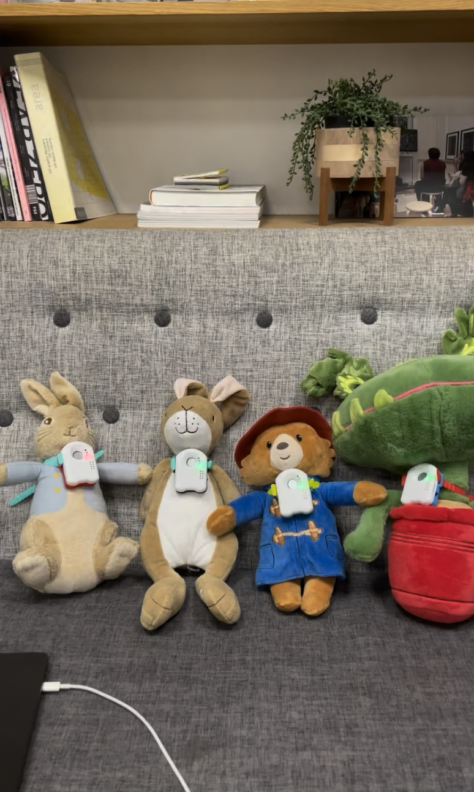

# [WIP] Here are some use cases for the Elato AI device

*Cute AI plush toys for kids, elderly, and more!*

## Healthcare, Well-being & Companionship:

1. Pediatric Comfort Companions: AI-powered plush toys designed to soothe children in stressful environments (like hospitals or clinics) with calming voices, stories, or simple interactive games.
2. Elderly Conversational Partners: Devices focused on reducing loneliness for seniors, capable of engaging in simple chats, recalling programmed memories/stories, playing music, or providing gentle reminders for medication or appointments.
3. Cognitive Engagement Tools (Elderly Care): Interactive devices that lead seniors through simple voice-based cognitive exercises, memory games, or trivia to promote mental activity.
4. Speech Practice Tools (Pediatrics/Therapy): Custom AI characters that encourage children or individuals in speech therapy to practice pronunciation, vocabulary, or conversational flow in a non-judgmental way.
5. Mindfulness & Guided Meditation Devices: Dedicated hardware that uses a calming AI voice to lead users through mindfulness exercises or guided meditations.
6. Basic Emotional Support Aids (Ethical Considerations Needed): Carefully designed companions programmed with supportive and empathetic scripts to offer comfort or a listening ear (needs strict ethical boundaries and cannot replace professional help).

## Education & Development:

1. Interactive Language Learning Tutors: Devices that act as conversational partners for language learners, allowing practice with pronunciation, vocabulary, and real-time interaction.
2. Dynamic Storytelling Toys: Characters that co-create stories with a child, adapting the narrative based on the child's verbal input and choices.
3. Specialized Educational Assistants: AI personalities embedded in learning tools (e.g., a model skeleton that explains anatomy when asked, a globe that talks about countries).
4. Social Skills Development Aids: Tools providing a safe space for individuals (e.g., children on the autism spectrum) to practice conversational turn-taking and social cues with a patient AI character.

## Accessibility & Assistance:

1. Simplified Communication Hubs: Voice-activated devices for users with limited mobility or tech-savviness to easily initiate calls or send pre-set messages to family/caregivers.
2. Voice-Based Environment Guides: Low-cost, interactive information points in specific locations (museums, public buildings, care facilities) providing directions or information via voice Q&A.
3. Custom Assistive Interfaces: Prototyping tailored voice command systems for individuals with specific physical needs to control devices or communicate more easily.

## Specialized & Niche Applications:

1. Interactive Museum Exhibits/Characters: Bringing exhibits to life by allowing visitors to "talk" to historical figures, animated characters, or informative objects.
2. Role-Playing for Training: Creating physical devices embodying specific personas for customer service, sales, or even basic medical intake simulation training.
3. Smart Home Persona Hubs: Giving a smart home system a unique voice and personality that can interact more naturally than standard voice assistants.
